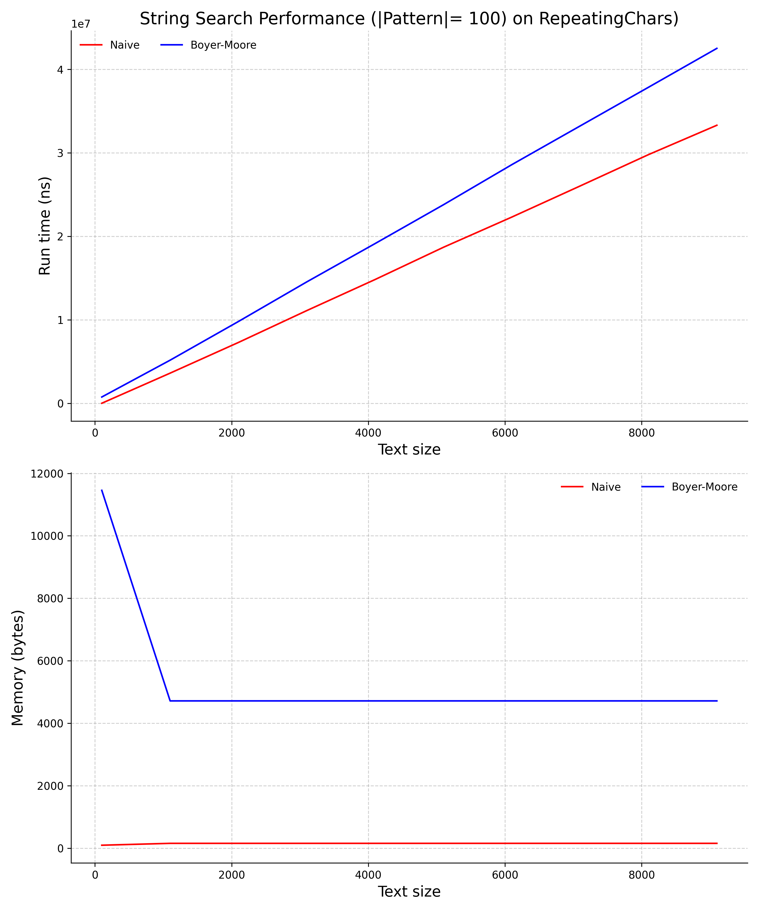
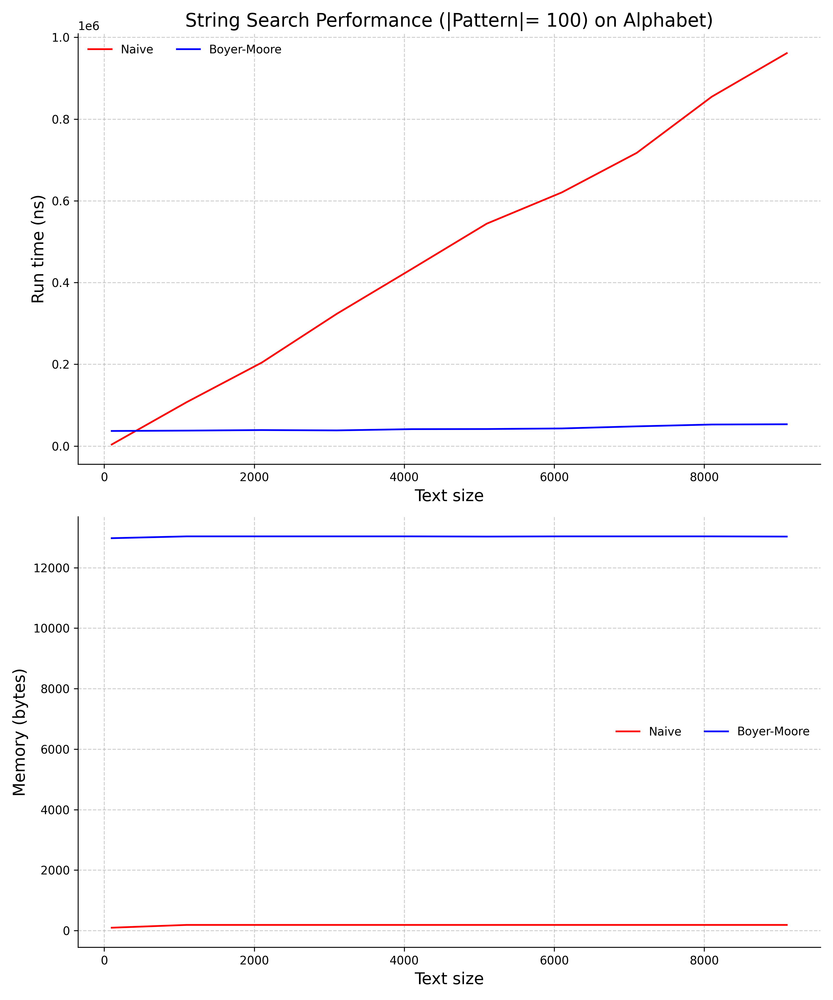

[](https://classroom.github.com/a/08twE9R9)
# string_search
Empirical comparison of string search methods (Naive vs Boyer-Moore) on different types of text.

## Usage
```
usage: string_search.py [-h] [
--experiment_type {Nucleotides, Alphabet, RepeatingChars}]  
--text_range TEXT_RANGE TEXT_RANGE TEXT_RANGE  
--pattern_size PATTERN_SIZE [--rounds ROUNDS]  
--out_file OUT_FILE [--width WIDTH] [--height HEIGHT]

optional arguments:
  -h, --help            show this help message and exit
  --experiment_type {Nucleotides, Alphabet, RepeatingChars}
                        Type of experiment to run (default: Nucleotides)
  --text_range TEXT_RANGE TEXT_RANGE TEXT_RANGE
                        Text size parameters (start stop step)
  --pattern_size PATTERN_SIZE
                        Pattern size
  --rounds ROUNDS       Number of rounds to run each algorithm (default: 10)
  --out_file OUT_FILE   File to save plot to
  --width WIDTH         Width of plot in inches (default: 8)
  --height HEIGHT       Height of plot in inches (default: 5)
```

## Examples
```
python3 src/string_search.py \
    --experiment_type RepeatingChars \
    --text_range 100 10000 1000 \
    --pattern_size 100 \
    --rounds 10 \
    --out_file doc/worstcase_search.png
```
<center></center>

```
python3 src/string_search.py \
    --experiment_type Alphabet \
    --text_range 100 10000 1000 \
    --pattern_size 100 \
    --rounds 10 \
    --out_file doc/alphabet_search.png
```
<center></center>

```
python3 src/string_search.py \
    --experiment_type Nucleotides \
    --text_range 100 10000 1000 \
    --pattern_size 100 \
    --rounds 10 \
    --out_file doc/nucleotide_search.png
```
<center></center>